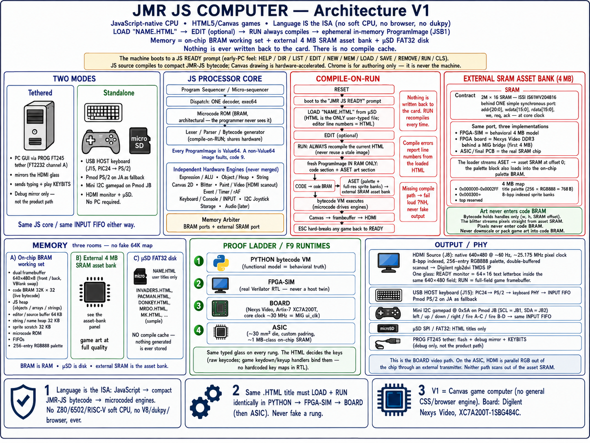
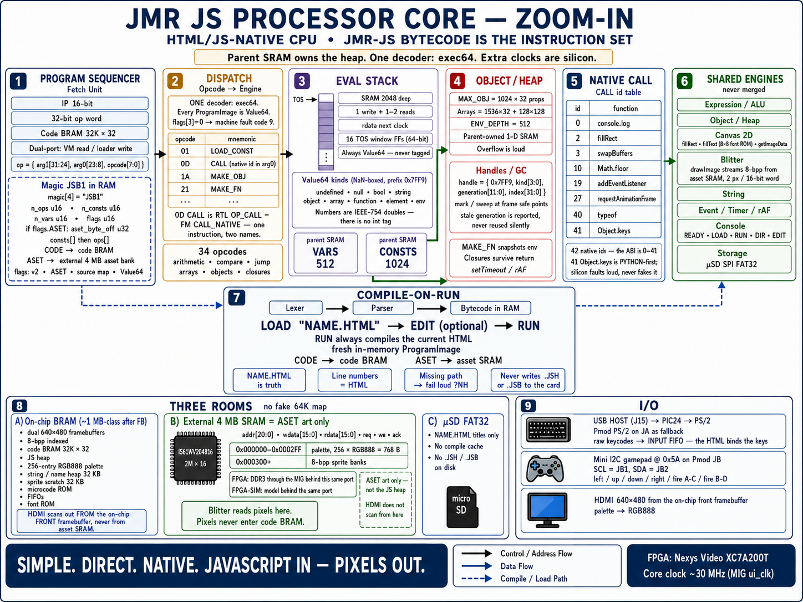
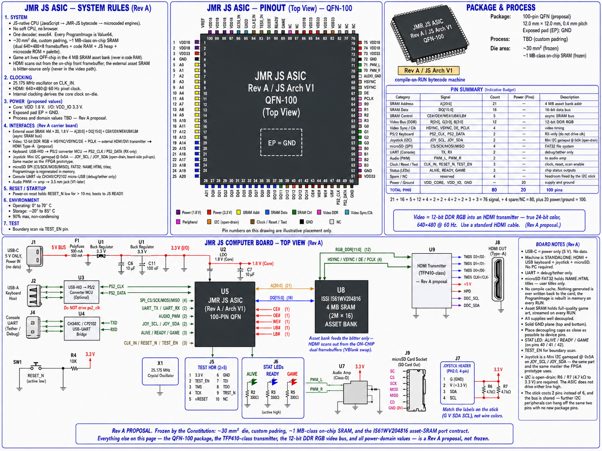

# Architecture

This document walks the NLISC-JS game machine block by block and says where
each block lives in the Python Functional Model. Every block on the
(eventual) diagram should have exactly one module; every module corresponds to
a block. That correspondence is the point — SystemVerilog is a translation,
not a redesign.

**Constitution:** [../CONSTITUTION.md](../CONSTITUTION.md) wins on conflict.
**Board / HDMI / input freeze:** [FPGA_BRINGUP.md](FPGA_BRINGUP.md).

**One-page poster** (sibling style to the JMR BASIC Architecture 2.0 diagram).
Render **2026-08-21** — replaces the render whose errata ran to fifteen
bullets. Regeneration prompt:
[POSTER_PROMPT_ARCHITECTURE_V1.md](POSTER_PROMPT_ARCHITECTURE_V1.md).



### Architecture V1 poster errata (render 2026-08-21)

The previous errata list is **cleared** — `.JSH`, `rge`, `IAF`, the extra map
zeros, "Never never", `NAME.DAT`, the jammed "microcode ROM FIFOs", the
"SRA M" panel title, the GPIO joystick, and the five-verb console are all
fixed in this render. One typo survives:

- COMPILE-ON-RUN flow: "Canvas → **framebueffer** → HDMI" — should read
  **framebuffer**.

See also the shared colour note under the ASIC board poster: "8-bpp indexed,
256-entry RGB888 palette" is the accurate phrasing on this poster, and it is
what the OUTPUT / PHY panel says.

**Core zoom-in poster** (sibling style to the JMR BASIC Processor Core
zoom-in diagram) — the JS processor core itself: program sequencer, `exec64`
dispatch, Value64 eval stack, object/heap, native call, shared engines,
compile-on-RUN, three memory rooms, I/O. Render **2026-08-21** (replaces the
2026-08-18 render that still showed the retired `exec32` twin). Regeneration
prompt: [POSTER_PROMPT_CORE_ZOOM_IN.md](POSTER_PROMPT_CORE_ZOOM_IN.md).



### Core zoom-in poster errata (render 2026-08-21)

**None known.** Everything the previous errata listed is fixed: one decoder
`exec64` with `flags[3]=0` → fault code 9; the nine NaN-boxed Value64 kinds
under prefix `0x7FF9` with no `int` tag; the ABI stated as ids 0–41 (42
total); `VARS` / `CONSTS` labelled parent SRAMs inside the eval stack; EDIT
marked optional; `0D CALL` annotated as RTL `OP_CALL` = FM `CALL_NATIVE`; the
stray `~30 mm²` removed from the BRAM box; the I2C gamepad, the JA PS/2
fallback, the MIG `ui_clk` clock, and the 32 KB sprite scratch all correct.

Capacities on the poster match silicon (`jmr_js_vm.sv` / `jmr_js_vm_pkg.sv` /
`jsb_format.py`): `MAX_OBJ=1024×32`; arrays `1536×32 + 128×128`;
`ENV_DEPTH=512`; `STACK_DEPTH=2048`; `MAX_VARS=512`; `MAX_CONSTS=1024`;
`CODE_WORDS=32768`. Full opcode table and native ids:
[JMR_JS_COMPATIBILITY.md](JMR_JS_COMPATIBILITY.md#bytecode-opcodes-34).

**ASIC board poster (Rev A proposal)** — QFN-100 chip + external 4 MB asset
SRAM + HDMI transmitter carrier board, sibling style to the JMR BASIC ASIC
board poster. Render **2026-08-21**. Regeneration prompt:
[POSTER_PROMPT_ASIC_BOARD_REV_A.md](POSTER_PROMPT_ASIC_BOARD_REV_A.md).



### ASIC board poster errata (render 2026-08-21)

Most of the previous list is **cleared**: the frozen-vs-proposed banner, the
`(Indicative Budget)` heading, the removal of `RRAM_CTRL`, Audio (PWM) = 2, a
budget that sums to 100, `debug/tether`, `NAME.HTML titles`, the deleted
compile-cache line, and the I2C joystick on `JOY_SCL` / `JOY_SDA` are all
correct in this render. What is still wrong:

- **SYSTEM RULES §4 contradicts U8 on the same page.** The bullet reads
  "External asset SRAM: **4M × 20**, 1.8 V"; the part is **2M × 16** (4 MB),
  exactly as the U8 block in the board drawing says. The `4M × 20` figure was
  carried forward from the previous render into the regeneration prompt and
  should never have survived — corrected in the prompt now. The **1.8 V**
  on that bullet is also doubtful: `IS61WV204816` is a 2.5 V/3.3 V part and
  the poster's own I/O rail is 3.3 V. Treat the SRAM bus voltage as **TBD**,
  not 1.8 V.
- **Duplicate reference designator.** The power chain draws two adjacent
  blocks both labelled "U1 Buck Regulator 3.3 V". There is one 3.3 V buck;
  the second block should be a different designator or removed. "F1 Polyfuse
  500 mA" likewise prints "500 mA" twice.
- **QFN pin-ring labels are decorative and partly garbled** — `TES1_IN`
  (should be `TEST_EN`), `GCES IN`, `DEEF` / `OEEF`, and `JOY_SCL` /
  `JOY_SDA` do not appear on the ring at all. The poster already declares
  pin numbers illustrative; extend that to the **names**. The **PIN SUMMARY
  table is the authoritative pin list**, and it is correct.
- **"true 24-bit color" needs its qualifier.** See the colour note below.
- **J8 is drawn as a generic rectangular connector.** The label
  "HDMI OUT (Type-A)" is right — it is an ordinary full-size HDMI receptacle
  taking a standard HDMI cable. Only the glyph is wrong; nothing in the
  design calls for a non-standard connector.

### Colour: 8-bpp indexed, 24-bit palette, 24-bit wire

The three numbers on the posters describe different points in one pipeline,
and "true 24-bit color" on the ASIC video note is about the **wire**, not the
number of simultaneous colours. Authoritative chain
(`rtl/video/jmr_hdmi_scanout.sv:11-56`):

| Stage | Width | Meaning |
|---|---|---|
| Framebuffer (`fb_index`) | **8 bits/pixel** | indexed; 640×480×8 = 307,200 B per buffer, two buffers |
| Sprite banks in asset SRAM | **8 bpp** | 2 pixels per 16-bit word |
| Palette (`pal_rgb`) | **256 × 24-bit RGB888** | 256 simultaneous colours, each chosen from 16,777,216 |
| HDMI wire (`vid_pData`) | **24 bits/pixel** | RGB888 into `rgb2dvi` (FPGA) or the transmitter (ASIC) |

So: **256 colours on screen at once, each defined to 24-bit precision, sent
out over a 24-bit link.** The ASIC's 12-bit DDR RGB bus carries those same 24
bits as 12 × 2 edges per pixel. A future render should say "256 simultaneous
colours from a 24-bit palette" rather than leaving "true 24-bit color"
unqualified.


---

## The idea

A conventional computer executes assembly (or a soft CPU), and a runtime /
browser implements JavaScript:

```
CPU  ->  browser / VM  ->  JavaScript
```

This machine reverses that. JS source becomes compact bytecode; bytecode *is*
the machine code:

```
JavaScript  ->  bytecode  ->  processor (microcode + engines)
```

There is no hidden general-purpose core underneath. **No dukpy/V8/browser as
the machine.** This is **NLISC-JS**: JS bytecode is the ISA; HTML is the
title file. V1 is a **Canvas game computer** (HTML titles → JMR bytecode).
Family name: [../README.md](../README.md#nlisc-native-language-instruction-set-computing).

```
NAME.HTML  →  RUN always compiles  →  ephemeral ProgramImage
           →  code → code BRAM, ASET → external SRAM asset bank  →  VM
```

User types only `LOAD "NAME.HTML"` / `RUN`. Chrome may open the same file for
authoring; PYTHON / FPGA-SIM / BOARD / ASIC must run the **JMR VM**.
Not a general HTML/CSS browser in V1.

---

## High level view (V1)

```
USB keyboard ──► keyboard PHY ──┐
                                 ├──► INPUT FIFO → Console / JS events / ESC
Pmod joystick ─► GPIO reader ───┘
                              ↓
                         Lexer / Parser → bytecode
                              ↓
                    Program Sequencer + Dispatch
                              ↓
                         Microcode / JS core
                              ↓
        ┌──────────┬──────────┬──────────┬──────────┐
        │Expression│  Object  │  Canvas  │ Blitter  │
        │  / ALU   │  / Heap  │  Engine  │          │
        └──────────┴──────────┴──────────┴──────────┘
                              ↓
              Paint / Video (palette + HDMI 640×480)
                              ↓
          Framebuffers (V1: dual 640×480 BRAM)

Blitter ◄──► external SRAM asset bank (4 MB, simple SRAM port;
             FPGA board = DDR3 behind a bridge; ASIC = IS61WV204816)
```

Also: String, Event/Timer, Storage, Audio (later) — separate engines, shared
where reuse is honest. **No general CSS engine in V1.**

---

## Instruction flow (target)

| Step | Meaning | FM home (when present) |
|---|---|---|
| 1 | Fetch next bytecode / work unit | Program sequencer |
| 2 | Decode | Dispatch table |
| 3 | Load microcode entry | Microcode ROM |
| 4 | Execute micro-ops (drive engines) | Micro-sequencer |
| 5 | Complete statement / task | Sequencer outcome |

Stalls (e.g. waiting for input, blitter, or a timer) are pipeline stalls, not
host blocks. Compile/parse may take many cycles — that is intentional.

---

## What is deliberately not here

- **No hidden CPU.** Nothing evaluates JS by calling into V8 / QuickJS / a soft core.
- **No merged engines.** Expression, heap, Canvas, blitter, video stay separate.
- **No second JS heap in exec64.** One physical 1-D SRAM; do not skip generation
  to hide exec/parent dual-copy skew. FPGA-SIM is the standalone `.bin` path.
- **No BASIC token tables.** This is not a re-skinned BASIC machine.
- **No Nexys A7-100T assumptions.** Primary board is **Nexys Video** (XC7A200T);
  wiring owned by `FPGA_BRINGUP.md`. PA-StarLite is a later port.
- **No V1 general CSS / full browser.** Canvas + minimal HTML game container.

---

## BRAM / LUT policy

Prefer BRAM for palette, microcode, FIFOs, font, line buffers, bounded stacks,
**and the V1 working set.** Dual **640×480** FB lives in `jmr_mini_fb.sv`
BRAM. Also on-chip: code BRAM, JS heap. Game art lives in the **external
SRAM asset bank** (see below), never in code BRAM. µSD holds `NAME.HTML` +
user files only; the code + ASET ProgramImage is regenerated in memory on
every `RUN` and is not a persistent `.JSB` / `.JSH` sidecar. There is no
`NAME.DAT`. Do not fake a 64K map. Do not pack Donkey `data:image` sheets into
code BRAM or downscale them to “fit.”

**ASIC target (frozen 2026-08-13): ~30 mm² die ("double chip"), our own
custom padring, ~1 MB-class on-chip SRAM.** Use the BRAM the design needs
for speed; never shrink BRAM to chase a small die. Live FPGA chip totals:
[FPGA_FIT.md](FPGA_FIT.md).

---

## External SRAM asset bank

One **4 MByte SRAM, 2M × 16 (ISSI IS61WV204816)** behind a simple
synchronous port. Same port, three implementations; nothing above the port
ever changes:

| Rung | Implementation |
|---|---|
| FPGA-SIM | behavioral 4 MB model behind the identical port (RTL above is real) |
| FPGA board | Nexys Video **DDR3** behind a MIG-based bridge (first 4 MB used) |
| ASIC / final PCB | the real IS61WV204816; trivial timing wrapper |

**Port contract (`jmr_sram_port`, core clock):**

```
addr  [20:0]   16-bit word address (2M words = 4 MB)
wdata [15:0]   write data
rdata [15:0]   read data (valid with ack)
we             1 = write, 0 = read
req            request strobe (hold until ack)
ack            completion strobe (1+ cycles later; bridge may stall)
```

**4 MB map (V1):**

```
0x000000 – 0x0002FF   title palette (256 × RGB888 = 768 bytes)
0x000300 – top        sprite pixel banks (8-bpp indexed, 2-byte aligned)
top of bank           reserved (future FB / heap migration)
```

**V2.0 asset bank (planned — not implemented):** rebuild to **8 MB** (or
larger if a title needs it). Driver: `MK.HTML` ASET is **~4.63 MB** indexed
pixels today. Keep the **same simple port** (`we`/`req`/`ack`, 16-bit data);
widen `addr` for 8 MB+ words. **ASIC rule:** still **one external (or
on-die) SRAM chip** — no multi-chip fancy access / bank gymnastics. FPGA
board may use DDR3 behind the port (first 8 MB). Detail:
[JMR_JS_COMPATIBILITY.md § Version 1.0 vs 2.0](JMR_JS_COMPATIBILITY.md#version-10-vs-20).

**ProgramImage container (JSB encoding + ASET):**

- Header flags: bit0 = v2 trailer (existing), **bit1 = ASET present**. When
  bit1 is set, a `u32 aset_byte_off` (offset from file start) follows the
  12-byte header, before consts.
- Code part (header, consts, ops, v2 trailer) streams to **code BRAM** as
  today. The v2 trailer carries **SPRD** sprite descriptors
  (`n_spr:u16`, then per sprite `w:u16, h:u16, sram_off:u32`) — handles
  only, no pixels. Legacy SPR1 (pixels in trailer) remains only for tiny
  `.JS` demos.
- ASET part at `aset_byte_off`: magic `"ASET"` + `u32 payload_len` +
  payload = palette block (768 bytes) + sprite banks. The loader streams
  the payload to asset SRAM address 0 (palette also loads the palette
  BRAM). `sram_off` descriptors point into this payload.
- Missing/truncated ASET when SPRD expects one → **fail loud** (`?NH`-class
  error), never silent blank sprites.

## FM → RTL correspondence

As modules land, keep a table here: diagram block → `functional_model/…` →
`rtl/…`. Folds must be documented (same rule as the BASIC sibling method).

| Diagram block | Functional Model | RTL |
|---|---|---|
| Console / Machine | `functional_model/machine.py` | `rtl/engines/jmr_console_engine.sv` |
| INPUT / keyboard | FIFO + `ps2_decode` path | `jmr_keyboard_fifo` + `ps2_rx`/`ps2_decode` (board: J15 dead → PROG tether) |
| INPUT / play keys | GUI KEYBITS | `jmr_uart_link` `0xFE` → `joy_in` (SIM + board tether) |
| INPUT / joystick | `functional_model/input_engine.py` | FPGA-SIM: `jmr_js_core.joy_in` (GUI KEYBITS). Board: `rtl/phys/jmr_i2c_joy.sv` via `top_nexys_video`. **Not** `jmr_input_engine.sv` (stub) and **not** `tools/pmod_input_test/` (LED bit) |
| Canvas / FB | `functional_model/canvas_engine.py` | `jmr_mini_fb.sv` native **640×480** dual-buffer BRAM (SIM; next bit) |
| One-glass letterbox | `CanvasEngine.paint_console_letterbox` | `jmr_text_hdmi_scanout.sv` + dual-clock `jmr_video_vram` |
| Bytecode VM | `functional_model/bytecode.py` + `jsb_format.py` | `rtl/engines/jmr_js_vm.sv` (writable ProgramImage BRAM) |
| Storage | `functional_model/storage_engine.py` | `storage_engine.sv` + SD SPI + console load |

**Honest path:** product titles are `*.HTML`. **`RUN` always compiles** the
loaded HTML into one in-memory ProgramImage for the **JMR bytecode VM** on
PYTHON, FPGA-SIM, BOARD, ASIC. Full-quality graphics ride its ASET section
into the external SRAM asset bank (no `NAME.DAT`; EDIT+RUN regenerates
everything). Never persist or prefer a `.JSB` / `.JSH` sidecar. dukpy is a
**cheat / debt** if used as the game engine. Never call dukpy “FPGA-SIM.”
The user only types
`LOAD "NAME.HTML"` / `RUN`.
See [SESSION_HANDOFF.md](SESSION_HANDOFF.md) and
`.cursor/rules/no-dukpy-cheat-native-cpu.mdc`.

---

## Related

- [FPGA_BRINGUP.md](FPGA_BRINGUP.md)
- [FPGA_FIT.md](FPGA_FIT.md)
- [SESSION_HANDOFF.md](SESSION_HANDOFF.md)
